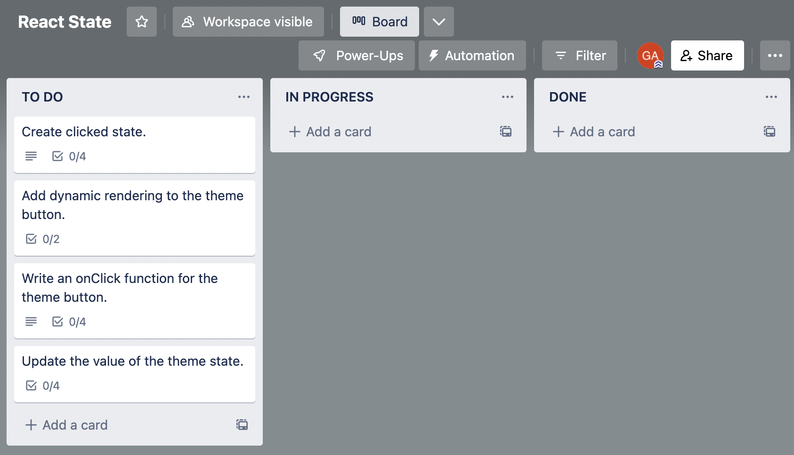

# React State

You are an employee at Dark Mode Inc., a startup company that is developing a new software development tool that allows developers to easily add dark mode to their websites and applications. You have been tasked with creating a working test of the proposed dark mode button for the company's website. Another developer has set up the React application with a non-functioning button and written some tests to enforce the criteria and structure requested by the company. It is your responsibility to give functionality to that button.

The button is supposed to toggle the dark mode theme of the website. When the button is clicked, the website should switch to dark mode if it is currently in light mode, and vice versa.

Once you have the button working, you'll need to test it to make sure that it is working as expected. Conveniently, you can use the tests that the other developer has written to help you. These tests will verify whether or not the button is toggled correctly and that it changes the theme of the website as expected.

---

1.  Modify the existing “theme” button to dynamically render the text “Dark Mode” or “Light Mode”

2.  Create an onClick function and some logic that will dynamically update the class of main content and footer.

3.  When finished the background of the page should switch from white to black, as well as invert the font color with every press of the button.

4.  Run the test suite for the react app to check if your automated tests are passing as you work through this task.  You will start with four failing tests and hope to progressively get the tests to pass as you implement state and modify content.

---

<!-- [Trello Board](https://trello.com/b/7z1lDKxr/react-state) -->

---

#### Step 1:

1. Fork and clone [this](https://git.generalassemb.ly/SEI-Standard-Curriculum/M3L3-4-react-state-handling-input-events-wbp) repo
1. Navigate into the react-dark-mode sub directory and run ‘npm install’ to install the needed dependencies to run your React app and tests.

#### Step 2:
1. Create a Nav component to hold the `<nav>` tags and all of the content within them.
1. Working in the `Header` component, import the necessary hook from react to create a new piece of state
1. Call your state `clicked`
1. Ensure you choose an appropriate setter name in keeping with convention
1. Give your state an initial value of `true`. Use your react dev tools to ensure you've set up your state correctly

#### Step 3:
1. Modify the theme button so that it renders a variable called `buttonText` rather than `"theme button"`. Set the initial value to an empty string.
1. Write a ternary expression to change the value of `buttonText` to the string `"Light Mode"` or `"Dark Mode"` depending on whether the clicked state is `true` or `false`.

#### Step 4:
1. Write an `onClick` function using a simple `console.log` of your choice for testing purposes.
1. Wire up the `onClick` function to the theme button and test it out in the browser - you should see your text in the console.
1. Update your `onClick` function to toggle the clicked state, switching it back and forth between `true` and `false` (hint - the logical `NOT` may be useful here).
1. Using your react dev tools, ensure that the state is switching between `true` and `false` with each click.

#### Step 5:
1. Use a ternary expression and the theme state setter to assign one of two classes (strings) to the theme state that exists on `app.js`.
1. This ternary should change theme to the string "dark-mode" when clicked is `true`.
1. This ternary should change theme to the string "light-mode" when clicked is `false`.
1. Run the "npm run test" command in your `"react-dark-mode"` directory from the command line and make sure all tests pass.

This exercise is all about repetition and comfort with creating and modifying state in React.

<!-- ## Trello Board
When working through this scenario make sure to follow a pattern of tracking your specific, component based tasks in Trello.  When working on a task make sure to move the associated ticket to the "In Progress" column.  Once you have successfully gotten the test to pass for a specific component you are free to move that ticket to "Done".  Make sure to work on only one ticket at a time. -->

# react-wbp
# react-movies
